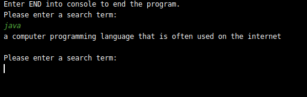

# Dictionary CLI Application
## Introduction
Wanna be cool? Want to be able to search words just from your terminal? This is your chance. Download this application and you will be able to find out the words
you are curious about in a blink.

## Prerequisites
1. Java 11
2. Jar file from latest release

## Getting Started
In your terminal, enter this command and replace filename with the name of the latest release.

    java -jar [filename].jar

To search for a keyword: 

If you have any issues, please feel free to post it in the issues section.
This is just a hobby for me to practice Java and relevant APIs. Thank you!